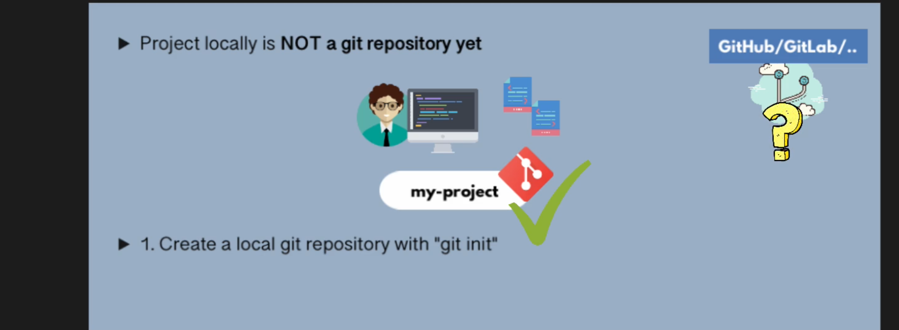
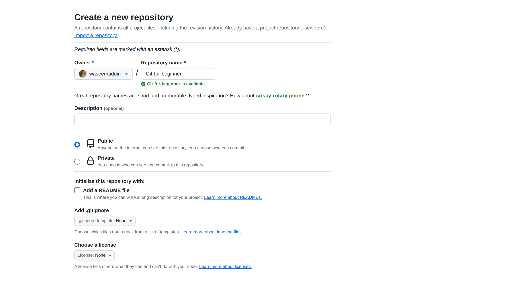
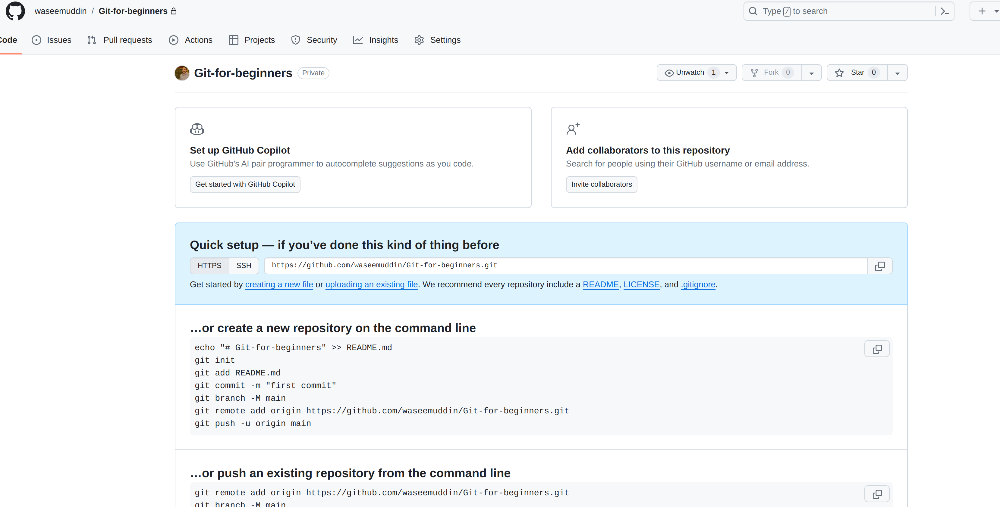
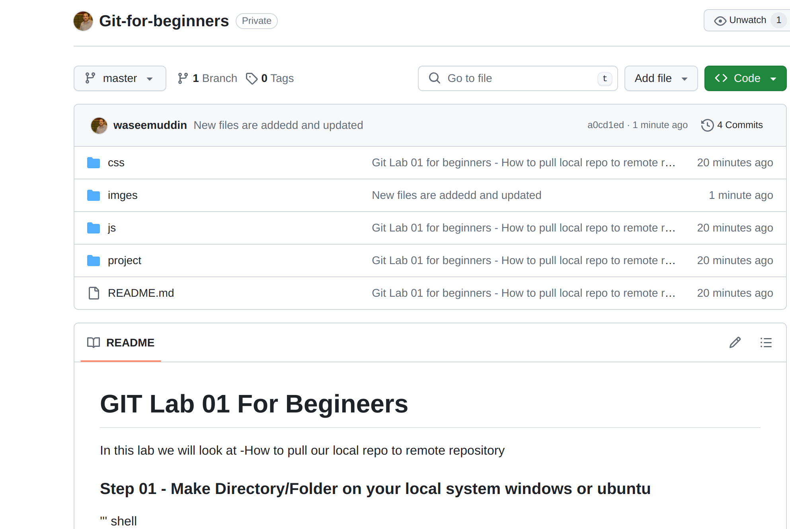

Please follow the below links for more updates and Projects

💾 <a href="https://shaikhwaseem.com" target="_blank">shahikhwaseem.com</a> <br>

💾 <a href="https://www.youtube.com/@waseeemuddin" target="_blank">Youtube Link</a>


# GIT Lab 01 - How to Push Project folder to Remote Repository

GitHub is a popular platform for hosting and collaborating on code repositories. Whether you are new to coding or an experienced developer, knowing how to create a repository and push your code to GitHub is a crucial skill.

In this step-by-step Lab, I will guide you through the process of creating your first GitHub repository and pushing your code to GitHub Account. By the end of this Lab, you will have the necessary skills to get started with version control, code hosting, and collaboration on GitHub. I will try my best to cover topics such as GitHub basics, repository creation, and pushing code to GitHub.


# 

### Step 01 - Make Directory/Folder on your local system windows or ubuntu

``` shell
$ mkdir Git-for-begineers
$ cd Git-for-begineers
$ git status
```
# 

### Step 02 - create some files into the git local directory/folder

``` shell
$ mkdir imges 
$ mkdir js
$ mkdir css
$ mkdir project 
$ touch css/front.css
$ touch js/mysim.js
$ touch index.php
```


### Step 03 - After editing and adding completed, run the below commands

``` shell
$ git init
$ git status
$ git add .
$ git commit
```
# 

# 

# 

# 

Our local repository files are commited and now its time to push into remote repository

# 

To push your code to remote repository, first you have to create the empty reposity on your github account

### Step 04 - Create Empty Repo on your Github Account
 
 Got your github accunt profile and create new repository

 # 

 # 


### Step 05 - Push Local Repo to Remote Repo

Now its time to push your local repository to your remote repository means your Github account

 # 

 # 

 # 

 # 


As you see all local repository files/folders are now push to remote repository


 # 

