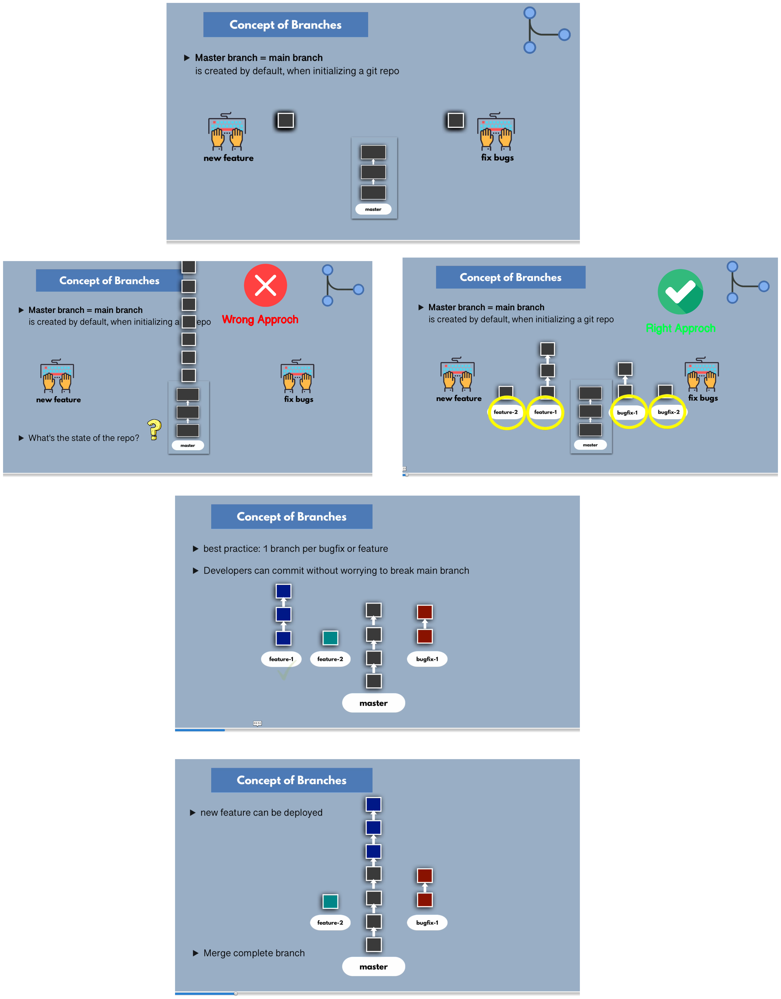

Please follow the below links for more updates and Projects

💾 <a href="https://shaikhwaseem.com" target="_blank">shahikhwaseem.com</a> <br>

💾 <a href="https://www.youtube.com/@waseeemuddin" target="_blank">Follow my YouTube channel</a>


##  GIT Lab 02 - How to Create and Manage Git Branches

In this lab we will look at the Git Brnach and how to create git branches and manage them

Below is the explanation how Git-Brach Works

# 


### Example - Consider as real case project

**Let's consider a real-world project example: building a website. Imagine you and your team are working on a website project, and you decide to use Git to manage your code.**

**Step # 01 - Main Branch (Master/Branch):**  Your main branch, often called "master" or "main", represents the stable version of your website that's ready to be published. It contains all the  upto date features and bug fixes means final and updated copy.
<br>


**Step # 02- Creating a New Branch:** Let's say you want to add a new feature to your website, like a contact us form and you need to create a new branch called "contact-us-form".

``` shell

$ git checkout -b contact-us-form

```
**Step # 03 - Making Changes:** On the "contact-us-form" branch, you work on adding the contact us form features to your website. You have to create the files like PHP, HTML, CSS, and JavaScript files for the form.
<br>


**Step # 04 - Committing Changes:** Once you're done, you commit your changes to the "contact-us-form" branch.

``` shell
$ git status
$ git add .
$ git commit -m "Added contact form feature"
$ git branch

```


**Step # 05 - Switching Between Branches:** Now, let's say your team needs you to fix a critical bug on the main website. You switch back to the main branch to address it.

``` shell

$ git checkout main or git checkout master
$ git branch

```


**Step # 06 - Making Changes:** On the main/master branch, you fix the bug by editing the affected files.


**Step # 07 - Committing Changes:** After fixing the bug, you commit your changes to the main/master branch.

``` shell
$ git staus
$ git add .
$ git commit -m "Fixed critical bug"
$ git branch

```

**Step # 08 - Merging Branches:** Once the bug is fixed and the contact us form feature is complete, Now you need to merge the "contact-us-form" branch into the main or master branch.

``` shell

$ git status
$ git checkout main
$ git merge contact-us-form

```


**Step # 09 - Deleting a Branch:** After merging, you can delete the "contact-us-form" branch. (Its user choise)

``` shell

$ git branch -d contact-form

```

*******************THATS IT********************