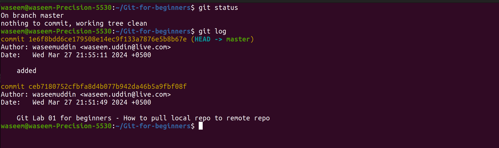
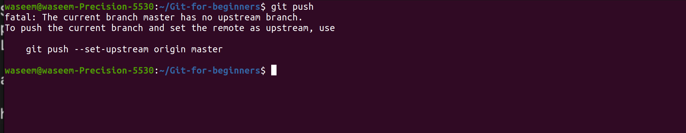

Please follow the below links for more updates and Projects

💾 <a href="https://shaikhwaseem.com" target="_blank">shahikhwaseem.com</a> <br>

💾 <a href="https://www.youtube.com/@waseeemuddin" target="_blank">Youtube Link</a>


# GIT Lab 01 - How to Push Project folder to Remote Repository

In this lab we will look at How to pull our local repo/prject to remote repository means github account


# 


### Step 01 - Make Directory/Folder on your local system windows or ubuntu

``` shell
$ mkdir Git-for-begineers
$ cd Git-for-begineers
$ git status
```
# 

### Step 02 - create some files into the git local directory/folder

``` shell
$ mkdir imges 
$ mkdir js
$ mkdir css
$ mkdir project 
$ touch css/front.css
$ touch js/mysim.js
$ touch index.php
```


### Step 03 - After editing and adding completed, run the below commands

``` shell
$ git init
$ git status
$ git add .
$ git commit
```
# 

# 

# 

# 

Our local repository files are commited and now its time to push into remote repository

# 

To push your code to remote repository, first you have to create the empty reposity on your github account

### Step 04 - Create Empty Repo on your Github Account
 
 Got your github accunt profile and create new repository

 # 

 # 


### Step 05 - Push Local Repo to Remote Repo

Now its time to push your local repository to your remote repository means your Github account

 # 

 # 

 # 

 # 


As you see all local repository files/folders are now push to remote repository


 # 
THis is my repo files  and filders need to be pushed and updated


